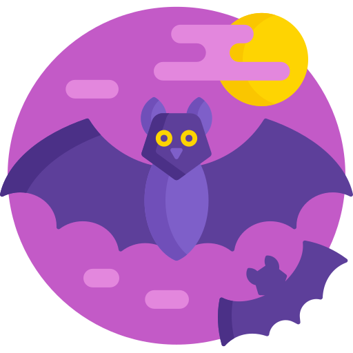

<h3 align="center">Conceitos ReactJS - Nível 01 - Desafio 03</h3>

---

 
  Desafio 03: Conceitos do ReactJS
    

## 📝 Content:
- [About](#about)
- [Start](#start)
- [Tests](#tests)
- [Authors](#authors)

## ℹ️ About the project: 
This project is maked for chalenge of <a href="https://rocketseat.com.br" target="_blank"> `rocketseat`</a>, project `Desafio 03: Conceitos do ReactJS`.

## 🏃‍♀️️🏃‍♂️️ Start 
- Clone the project: `git clone https://github.com/EduardoAmncio/conceitos_reactJs.git`
- Install dependencies, run: `yarn`
- Start the app, run: `yarn start`

## 🔧🐞️ Running the tests: 
run: `yarn test`

## ✍️ Authors 
- [@EduardoAmncio](https://github.com/EduardoAmncio).
